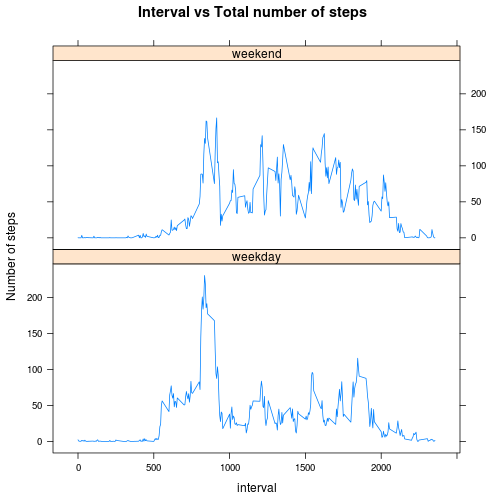

# Reproducible Research: Peer Assessment 1

In this assignment, we analyse the activity from a personal activity monitoring device.

## Data

The data for this assignment has been downloaded from the course web
site. It is also available in the current github repository (*activity.csv*).

* Dataset: [Activity monitoring data](https://d396qusza40orc.cloudfront.net/repdata%2Fdata%2Factivity.zip) [52K]

The variables included in this dataset are:

* **steps**: Number of steps taking in a 5-minute interval (missing
    values are coded as `NA`)

* **date**: The date on which the measurement was taken in YYYY-MM-DD
    format

* **interval**: Identifier for the 5-minute interval in which
    measurement was taken

The dataset is stored in a comma-separated-value (CSV) file and there
are a total of 17,568 observations in this
dataset.


## Loading and preprocessing the data
The activity data is loaded and all rows containing `NA`s are ignored.


```r
#setwd("~/Courses/DataScience/ReproducibleResearch/peer-assign1/RepResearchPeerAssign1")
activity <- read.csv("activity.csv",sep=",",header=TRUE)
act.na <- activity[!is.na(activity$steps),]
```

## What is mean total number of steps taken per day?
The following is the histogram of the total number of steps taken each day. 

```r
steps.date <- aggregate(act.na$steps, list(act.na$date), sum) 
names(steps.date) <- c("date","steps")
hist(steps.date$steps, xlab="Total no. of steps in a day",breaks=10,main="Histogram of total number of steps taken each day")
abline(v = mean(steps.date$steps), col = "blue", lwd = 1.5)
abline(v = median(steps.date$steps), col = "red", lwd = 1.5)
```

 


The mean number of steps is *10766.19* 
and the median is *10765*. They are very close (<1.5 steps) and hence the red line and blue line representing the median and mean in the above histogram are overlapping. 


```r
round(mean(steps.date$steps), 2) #mean
```

```
## [1] 10766
```

```r
median(steps.date$steps) #median
```

```
## [1] 10765
```


## What is the average daily activity pattern?


```r
steps.interval <- aggregate(act.na$steps, list(act.na$interval), mean) 
names(steps.interval) <- c("interval","steps")
plot(steps.interval$interval,steps.interval$steps, xlab="5 min interval of the day",
     ylab="Average number of steps across all days",type="l",main="Activity pattern in 5 min intervals of a day")
```

 

The maximum average number of steps is observed in the *835* interval.

```r
steps.interval$interval[which.max(steps.interval$steps)]
```

```
## [1] 835
```

## Imputing missing values

The activity data has missing values (NAs) in *2304* rows.


```r
nrow(activity)-sum(complete.cases(activity))
```

```
## [1] 2304
```

Each missing value was filled with the mean of the corresponding 5-minute interval over all days.


```r
new.activity <- activity
for(rowin in 1:nrow(new.activity)){
  if(is.na(new.activity$steps[rowin]))
  {
    new.activity$steps[rowin] <- steps.interval$steps[which(steps.interval$interval == new.activity$interval[rowin])]
  }
}
```

The following is the histogram of the total number of steps taken each day after filling the missing values. 

```r
new.steps.date <- aggregate(new.activity$steps, list(new.activity$date), sum) 
names(new.steps.date) <- c("date","steps")
hist(new.steps.date$steps, xlab="Total no. of steps in a day",breaks=10)
abline(v = mean(new.steps.date$steps), col = "blue", lwd = 2)
abline(v = median(new.steps.date$steps), col = "red", lwd = 2)
```

 


The mean number of steps is *10766.19* 
and the median is *10766.19*. In the new data, the mean has not shifted but
the median has shifted right. It is now the same as the mean. Hence, the red line and blue line representing the median and mean in the above histogram are overlapping. 


```r
round(mean(new.steps.date$steps), 2) #mean
```

```
## [1] 10766
```

```r
round(median(new.steps.date$steps),2) #median
```

```
## [1] 10766
```

## Are there differences in activity patterns between weekdays and weekends?

Differentiating the activity pattersn with respect to whether the day is a weekday or a weekend.


```r
new.activity$day <- (weekdays(as.Date(new.activity$date)) == "Saturday") | (weekdays(as.Date(new.activity$date)) == "Sunday")
new.activity$day[new.activity$day == TRUE] <- "weekend"
new.activity$day[new.activity$day == FALSE] <- "weekday"
```
A panel plot containing a time series plot of the 5-minute interval (x-axis) and the average number of steps
taken, averaged across all weekday days or weekend days (y-axis). 


```r
day.steps.interval <- aggregate(new.activity$steps, list(new.activity$interval,new.activity$day), mean) 
names(day.steps.interval) <- c("interval","day","steps")

library(lattice)
xyplot(day.steps.interval$steps~day.steps.interval$interval|day.steps.interval$day,type="l",
       xlab="interval", ylab="Number of steps",
       main="Interval vs Total number of steps",layout = c(1, 2)) 
```

 
